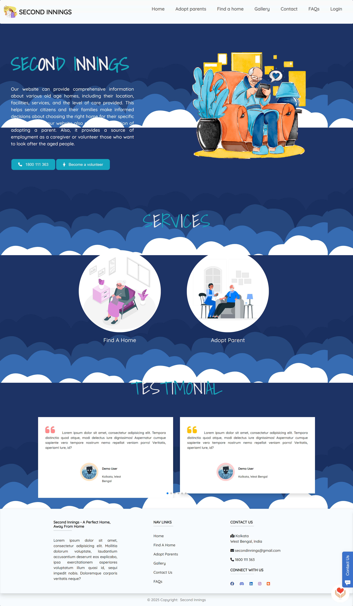

# 🌟 Second Innings

Second Innings is an all-in-one web application designed to simplify the process of finding old-age homes while introducing a unique Parent Adoption feature. Built using React, this platform bridges the gap between elderly individuals in need of care and compassionate individuals or families willing to support them.

### ✨ Key Features

✅ Old-Age Home Directory – Easily search and explore verified old-age homes with details and reviews.

✅ Parent Adoption Program – A dedicated feature allowing individuals to support or “adopt” elderly persons in need.

✅ Community & Support – Connect with caregivers, volunteers, and organizations offering assistance.

✅ Secure & User-Friendly – Intuitive interface with accessibility in mind for both elders and adopters.

✅ Interactive Maps – Locate nearby old-age homes, volunteers, and NGOs with an integrated mapping system.

🚀 This project aims to enhance elderly care accessibility while promoting a culture of compassion and inclusivity.


# 🛠 Tech Stack

## Frontend:

- ⚛ React – For building the user interface.
- 🎨 Tailwind CSS – For a modern and responsive design.

## Backend (Planned):

- 🏗 Node.js & Express.js – For API development.
- 🗄 MongoDB or PostgreSQL – For efficient data storage and retrieval.
- 🔐 JWT Authentication – To ensure secure user access.

## Additional Integrations:

-  Maps API – To visualize locations of old-age homes and volunteers.
- 📩 Email & Notification System – To enhance communication between users.

# 🚀 Installation & Setup
Follow these steps to set up and run the project locally:

## Prerequisites
- 📌 Ensure you have Node.js and npm (or yarn) installed.

### Steps
1. Clone the Repository:
```sh
git clone https://github.com/Souvik34/Second-Innings.git
```
2. Navigate to the Project Directory:

```sh 
cd Second-Innings/client
```
3. Install Dependencies:
```sh
npm install
```
or
```sh
yarn install
```
4. Start the Development Server:
```sh
npm run dev
```
or
```sh
yarn dev
```
5. Open in Browser:
The application will run at ```http://localhost:3000/```.


## Screenshot



## 🌍 Open Source Contribution

Second Innings is an open-source project, and we welcome contributions from the community! 🏆

## 📜 Contribution Guidelines:

1. Fork & Clone the repository.
2. Create a new branch for your feature or fix.
3. Follow clean code practices and ensure proper documentation.
4. Submit a pull request to the ```dev-Souvik``` branch for review.
5. Wait for approval before merging. 🚀

## 💡 Looking for contributors interested in:

- UI/UX improvements
- Backend development
- API integrations
- Bug fixes & optimizations

## 📬 Get Involved!

If you're passionate about making a difference in elderly care, join us in building Second Innings!
<br> 👨‍💻 Project Admin: @Souvik34 
<br>
Feel free to star ⭐ the repository, share feedback, or contribute. Together, let's create a compassionate and inclusive platform! ❤️
